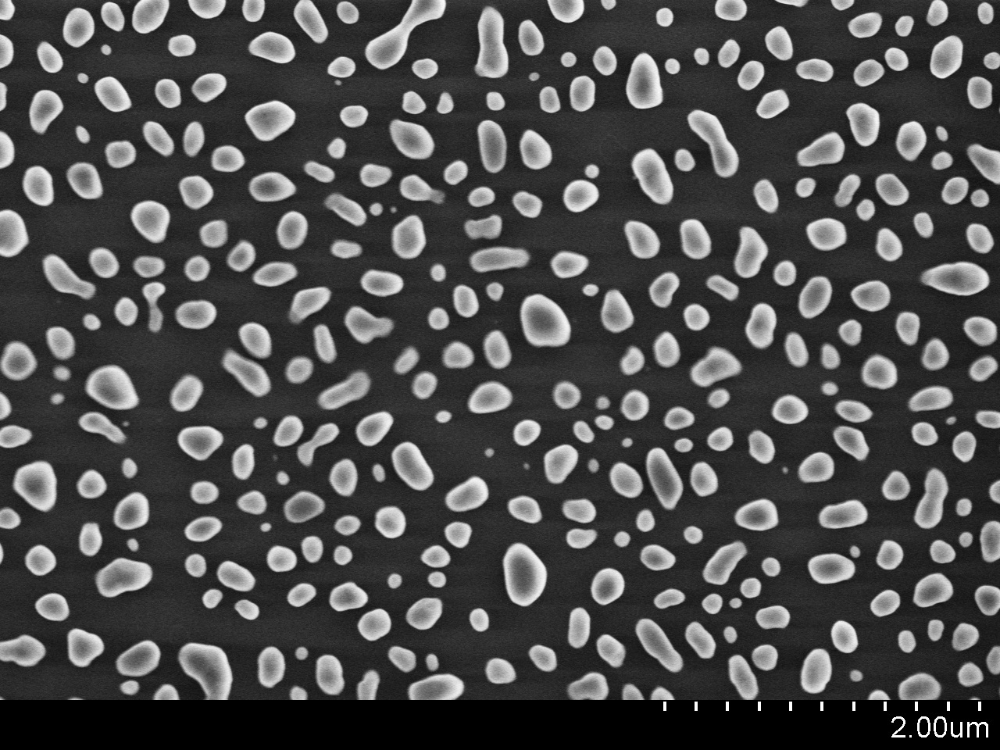
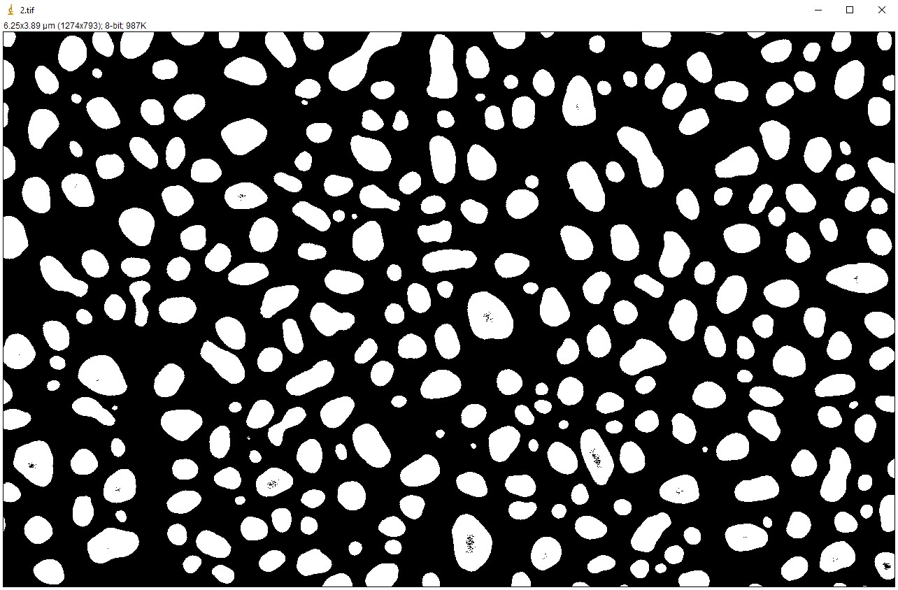
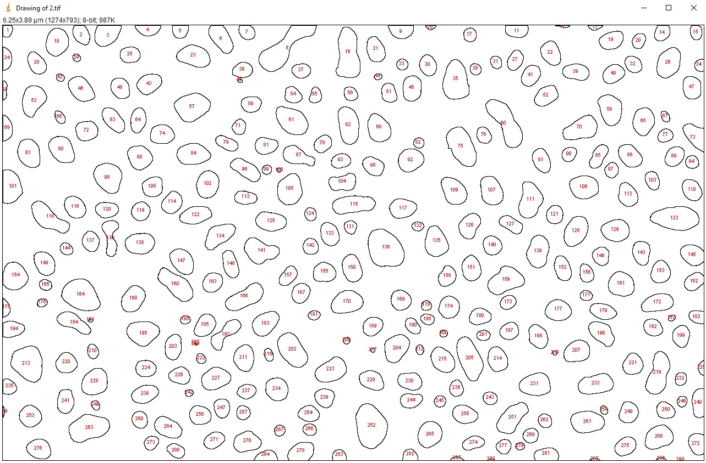
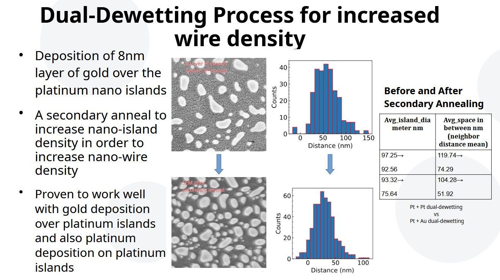

# Nanoisland Analysis Demo

Python-based post-processing workflow for **ImageJ Analyze Particles** output from SEM images of nano-islands / nanoparticles.

This repository demonstrates a compact scientific workflow:

1. Prepare the SEM image in **ImageJ**
2. Extract particle statistics with **Analyze Particles**
3. Export the results table as `.csv`
4. Run the Python script to calculate and visualize:
   - equivalent island diameter
   - edge-to-edge neighbor spacing
   - circularity
   - roundness
   - island density
   - area statistics

---

## ImageJ workflow: preparing the input data

### Step 1 — Set the scale from the SEM image
Before measuring particles, set the correct scale in ImageJ so that areas and coordinates are physically meaningful.

Typical workflow:
- Open the SEM image in ImageJ
- Use the scale bar or known image calibration
- Go to **Analyze → Set Scale**
- Enter the known distance and unit (for example `µm`)
- Confirm that the image dimensions now match the SEM field of view



### Step 2 — Adjust threshold and isolate the nano-islands
Separate the islands from the background as cleanly as possible.

Typical workflow:
- Go to **Image → Adjust → Threshold**
- Tune the threshold until islands are cleanly detected
- Avoid merging nearby islands if possible
- Check that background noise is not falsely selected
- Convert the thresholded image to binary



### Step 3 — Run Analyze Particles and save the results as CSV
Once the image is binarized, extract particle statistics.

- Go to **Analyze → Analyze Particles**
- Select the measurements you need beforehand using **Analyze → Set Measurements**
- In the Results window, save the table as `.csv`

This `.csv` file is the direct input for the Python script.



---

## Input data requirements

The script expects the ImageJ CSV to contain these columns:

- `Area`
- `X`
- `Y`
- `Circ.`
- `Round`

Place the file in the `sample_data/` folder or update the path in the script.

---

## Python analysis features

The script:
- loads the ImageJ results table
- removes small particles using a size threshold
- calculates equivalent disc diameter
- computes edge-to-edge spacing between islands
- extracts nearest-neighbor and pooled neighbor spacing statistics
- plots histograms for:
  - area
  - diameter
  - spacing
  - circularity
  - roundness
- exports processed data tables

---

## Example use case

### Dual dewetting study comparison with the script



---


## How to run

### 1. Install dependencies

```bash
pip install -r requirements.txt
```

### 2. Put your ImageJ CSV in the input folder

Default location used in the script:

```python
directory = "sample_data/"
filename = "Results.csv"
```

### 3. Run the script

```bash
python nanoisland_analysis.py
```

---

## Notes

- The spacing calculation is **edge-to-edge spacing**, not center-to-center distance.
- The script was written as a compact research/demo workflow rather than a full software package.
- This repository is intended as a short portfolio example showing Python-based scientific data processing.

---

## Tools used

- Python
- NumPy
- Pandas
- Matplotlib
- ImageJ
